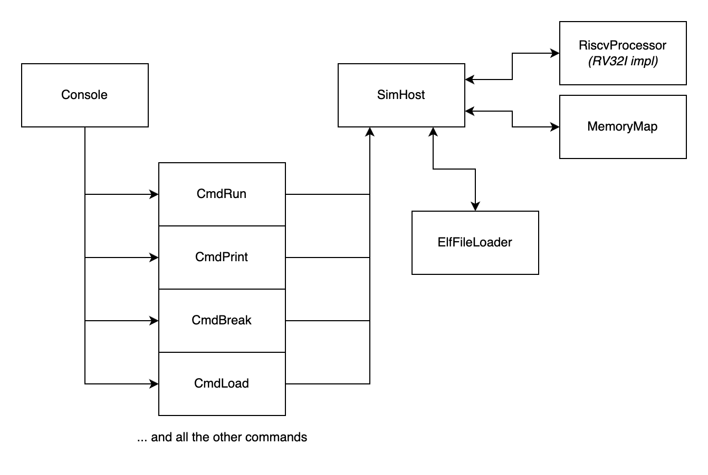

# riscvdb
RISC V simulator and debugger

Runs RISC V binaries on a simluated single core processor. Capable of gdb-like debugging.

The implemention supports the entire RV32I spec from [https://riscv.org/technical/specifications/](https://riscv.org/technical/specifications/) (all instructions and registers) and elements of the privileged spec (namely CSR registers, interrupts, and machine/user mode). The CSR registers implemented are the machine information registers, machine trap setup, and machine traip handling - see the [RISC V Pricileged Spec](https://riscv.org/technical/specifications/).

The 32-bit machine is configured with 4GB of RAM and the standard 32 registers + PC.

The simulator also includes and ELF file loader, which will load symbols and memory locations from the ELF files. This allows breakpoints and print statements to be done used via symbol names.

## Building

First, ensure the submodules are present (if not originally cloned using `--recurse-submodules`):

```
git submodule init
git submodule update
```

Then run CMake via the build script:
```
./build.sh
```

This builds the binary as `build/riscvdb`.

## Running

To display the help page, simply run `riscvdb -h`. To display a list of commands supported from within riscdb, run `help` from the prompt.

The autocomplete hints can be automatically completed using `Tab`.

### Executing a binary

Load the binary with either `riscvdb file.elf` or the `load` command from the prompt.

riscvdb currently only supports ELF files (`src/fileloader.cpp`).

Once the binary has loaded, invoke `run` or `r`. Execution can be interrupted using Ctrl-C.

You can also supply an automatic script via `riscvdb -x script_file` (examples of which are under `example_apps/`). Scripts are text files that include one command per line and can automate the loading and execution of binaries.

These examples will show how to build a RISC-V RV32I binary, how to load and execute this binary in the sim, and how to use the print functionality.

### Tests

Under `example_apps/` there are several small example programs that can be cross compiled using a RISCV cross compiler and executed on the RV32I CPU. These form examples of how to execute code on the RV32I simulated CPU.

To build the RISCV apps, you will need `riscv64-unknown-elf-gcc`.

The example apps vary in how much they depend on the C standard library (from not at all, and defining their own startup assembly, to fully integrated).

### Debugging

The following debugging commands are supported. They are intended to loosely following gdb-like syntax.

| Command | Short form | Description | Usage |
| ------- | ---------- | ----------- | ----- |
| `load` | `l` | Load a binary | `load filename` |
| `run` | `r` | Start execution from the beginning | `run [number_of_instructions]` |
| `step` | `s` | Single step instructions | `step [number_of_instructions]` |
| `continue` | `c` | Resume execution | `continue [number of instructions]` |
| `break` | `b` | Create breakpoint | `break (memory address or symbol name)` |
| `delete` | `d` | Delete a breakpoint | `delete breakpoint_number` |
| `print` | `p` | Print register value | `print address_or_symbol [size] [print_type]` |
| `info` | `i` | Display all machine registers | `info` |
| `verbose` | `v` | Start execution from the beginning | `verbose true_or_false` |
| `help` | `h` | Display help page. | `help` |
| `quit` | `q` | Exit simulator | `quit` |

# Design

The classes logically interact as:



For RAM emulation performance, the RAM model is a map of memory addresses to 1KiB blocks.
